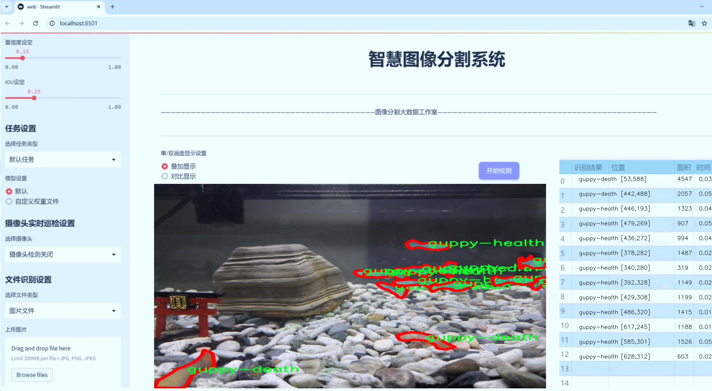
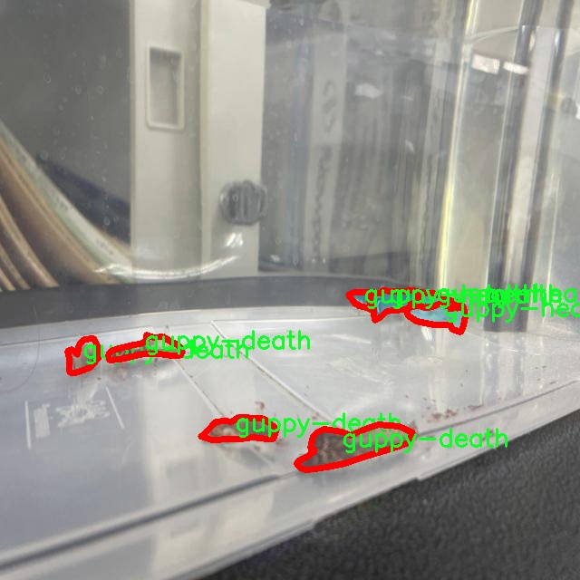

# 热带鱼健康状态分割系统： yolov8-seg-SPDConv

### 1.研究背景与意义

[参考博客](https://gitee.com/YOLOv8_YOLOv11_Segmentation_Studio/projects)

[博客来源](https://kdocs.cn/l/cszuIiCKVNis)

研究背景与意义

随着全球水产养殖业的快速发展，热带鱼作为一种受欢迎的观赏鱼类，其健康状态的监测与管理显得尤为重要。热带鱼的健康不仅直接影响养殖者的经济效益，也关系到生态环境的平衡。因此，如何有效地评估和监测热带鱼的健康状态，成为了水产养殖领域亟待解决的关键问题。传统的健康状态评估方法往往依赖于人工观察和经验判断，存在主观性强、效率低下等缺陷，难以满足现代化养殖的需求。

近年来，计算机视觉技术的迅猛发展为热带鱼健康状态的监测提供了新的思路。尤其是基于深度学习的目标检测与分割技术，能够在复杂环境中实现高效、准确的图像分析。YOLO（You Only Look Once）系列模型因其实时性和高精度，已广泛应用于各类图像识别任务中。YOLOv8作为该系列的最新版本，具备更强的特征提取能力和更高的处理速度，成为研究热带鱼健康状态的理想工具。

本研究旨在基于改进的YOLOv8模型，构建一个热带鱼健康状态分割系统，具体聚焦于三类目标：死亡的古比鱼（guppy-death）、幼鱼（guppy-fry）和健康的古比鱼（guppy-health）。通过对2700张图像的深度学习训练，该系统将能够实现对不同健康状态古比鱼的精准分割与识别。这一系统的建立，不仅能够提高热带鱼健康状态监测的效率和准确性，还将为养殖者提供科学依据，帮助其及时采取相应措施，降低损失。

此外，数据集的构建与使用也具有重要的学术意义。通过对古比鱼健康状态的分类与分割研究，可以为相关领域提供有价值的参考数据，推动水产养殖、生态保护等多学科的交叉研究。特别是在环境变化和养殖密度增加的背景下，鱼类健康问题愈发突出，基于深度学习的监测手段将为应对这一挑战提供新的解决方案。

综上所述，基于改进YOLOv8的热带鱼健康状态分割系统的研究，不仅具有重要的实际应用价值，还将为水产养殖行业的智能化发展提供技术支持。通过实现对古比鱼健康状态的高效监测，能够有效提升养殖管理水平，促进可持续发展。同时，该研究也为计算机视觉技术在生物监测领域的应用提供了新的视角和实践案例，具有广泛的推广意义。

### 2.图片演示





注意：本项目提供完整的训练源码数据集和训练教程,由于此博客编辑较早,暂不提供权重文件（best.pt）,需要按照6.训练教程进行训练后实现上图效果。

### 3.视频演示

[3.1 视频演示](https://www.bilibili.com/video/BV12UzFYmEG5/)

### 4.数据集信息

##### 4.1 数据集类别数＆类别名

nc: 3
names: ['guppy-death', 'guppy-fry', 'guppy-health']


##### 4.2 数据集信息简介

数据集信息展示

在本研究中，我们使用了名为“GuppyFinder”的数据集，旨在改进YOLOv8-seg模型，以实现对热带鱼健康状态的精准分割与识别。该数据集专门针对热带鱼，尤其是常见的古比鱼（Guppy），设计了丰富的标注信息，能够有效支持模型的训练与评估。GuppyFinder数据集包含三种主要类别，分别是“guppy-death”（死亡古比鱼）、“guppy-fry”（幼鱼）和“guppy-health”（健康古比鱼）。这些类别的选择不仅反映了古比鱼在不同生长阶段的状态，也为研究者提供了多样化的样本，以便更全面地理解和分析古比鱼的健康状况。

在数据集的构建过程中，研究团队精心收集了大量的图像数据，这些图像涵盖了不同环境、光照条件和拍摄角度下的古比鱼样本。每一类的图像都经过专业的标注，确保模型在训练过程中能够准确学习到每种状态的特征。例如，死亡古比鱼的图像通常表现出明显的体色变化和不活跃的姿态，而健康古比鱼则展现出活泼的游动和鲜艳的色彩。幼鱼的图像则需要特别关注其生长特征，以便模型能够识别出它们与成鱼的区别。

数据集的多样性是其一大亮点。GuppyFinder不仅包含了不同品种的古比鱼，还考虑到了不同的水族环境，如淡水和海水生态系统。这种多样性使得模型在训练时能够接触到更广泛的样本，从而提高其在实际应用中的泛化能力。此外，数据集还包含了一些特殊情况下的古比鱼图像，例如在疾病或受伤状态下的表现，这为模型的鲁棒性提供了良好的基础。

为了确保数据集的高质量，研究团队还进行了严格的数据清洗和筛选，剔除了模糊、低质量或重复的图像。每个类别的样本数量经过精心设计，以保证模型在训练时能够获得均衡的学习机会。通过这种方式，GuppyFinder不仅为YOLOv8-seg模型的训练提供了丰富的输入数据，也为后续的模型评估和优化奠定了坚实的基础。

在模型训练过程中，GuppyFinder数据集的应用将极大地提升YOLOv8-seg在古比鱼健康状态分割任务中的表现。通过精确的类别划分和高质量的图像数据，研究者能够更好地调优模型参数，进而实现更高的分割精度和更快的推理速度。这一数据集的成功应用，不仅为古比鱼的健康监测提供了新的技术手段，也为相关领域的研究提供了重要的参考和借鉴。

总之，GuppyFinder数据集以其丰富的类别、优质的样本和多样的环境设置，为热带鱼健康状态的研究提供了强有力的支持。通过对该数据集的深入分析与应用，研究者能够在古比鱼健康监测领域取得更为显著的成果，为未来的水族养殖和生态保护提供科学依据。





### 5.项目依赖环境部署教程（零基础手把手教学）

[5.1 环境部署教程链接（零基础手把手教学）](https://www.bilibili.com/video/BV1jG4Ve4E9t/?vd_source=bc9aec86d164b67a7004b996143742dc)


[5.2 安装Python虚拟环境创建和依赖库安装视频教程链接（零基础手把手教学）](https://www.bilibili.com/video/BV1nA4VeYEze/?vd_source=bc9aec86d164b67a7004b996143742dc)

### 6.手把手YOLOV8-seg训练视频教程（零基础手把手教学）

[6.1 手把手YOLOV8-seg训练视频教程（零基础小白有手就能学会）](https://www.bilibili.com/video/BV1cA4VeYETe/?vd_source=bc9aec86d164b67a7004b996143742dc)


按照上面的训练视频教程链接加载项目提供的数据集，运行train.py即可开始训练



     Epoch   gpu_mem       box       obj       cls    labels  img_size
     1/200     0G   0.01576   0.01955  0.007536        22      1280: 100%|██████████| 849/849 [14:42<00:00,  1.04s/it]
               Class     Images     Labels          P          R     mAP@.5 mAP@.5:.95: 100%|██████████| 213/213 [01:14<00:00,  2.87it/s]
                 all       3395      17314      0.994      0.957      0.0957      0.0843

     Epoch   gpu_mem       box       obj       cls    labels  img_size
     2/200     0G   0.01578   0.01923  0.007006        22      1280: 100%|██████████| 849/849 [14:44<00:00,  1.04s/it]
               Class     Images     Labels          P          R     mAP@.5 mAP@.5:.95: 100%|██████████| 213/213 [01:12<00:00,  2.95it/s]
                 all       3395      17314      0.996      0.956      0.0957      0.0845

     Epoch   gpu_mem       box       obj       cls    labels  img_size
     3/200     0G   0.01561    0.0191  0.006895        27      1280: 100%|██████████| 849/849 [10:56<00:00,  1.29it/s]
               Class     Images     Labels          P          R     mAP@.5 mAP@.5:.95: 100%|███████   | 187/213 [00:52<00:00,  4.04it/s]
                 all       3395      17314      0.996      0.957      0.0957      0.0845


### 7.50+种全套YOLOV8-seg创新点加载调参实验视频教程（一键加载写好的改进模型的配置文件）

[7.1 50+种全套YOLOV8-seg创新点加载调参实验视频教程（一键加载写好的改进模型的配置文件）](https://www.bilibili.com/video/BV1Hw4VePEXv/?vd_source=bc9aec86d164b67a7004b996143742dc)

### YOLOV8-seg算法简介

原始YOLOv8-seg算法原理

YOLOv8-seg算法是YOLO系列中的最新进展，标志着计算机视觉领域中目标检测和实例分割技术的又一次飞跃。自2023年1月10日发布以来，YOLOv8以其卓越的性能和灵活的应用能力，迅速成为了研究者和开发者的关注焦点。YOLOv8不仅在精度和执行时间上超越了前代模型，还在多种复杂场景下展现出优异的适应性和高效性。该算法的设计理念源于YOLOv5、YOLOv6和YOLOX等前辈模型的成功经验，经过一系列的改进和优化，形成了其独特的架构和功能。

YOLOv8的核心在于其创新的网络结构，主要由主干网络、特征增强网络和检测头三部分组成。主干网络采用了CSP（跨阶段局部网络）结构，这一设计使得特征提取过程更加高效，能够在保持计算速度的同时，提取出更为丰富的特征信息。CSP结构的引入，分离了特征提取的过程，使得模型在处理复杂场景时，能够更好地捕捉到目标的细节特征。特征增强网络则采用了PAN-FPN（路径聚合网络-特征金字塔网络）结构，旨在实现多尺度特征的融合与增强。这一设计使得YOLOv8在处理不同大小的目标时，能够保持高精度的检测能力。

在检测头部分，YOLOv8的创新尤为显著。与以往的耦合头不同，YOLOv8采用了解耦头结构，将分类和回归任务分开处理。这一解耦设计使得每个任务能够更加专注于自身的目标，显著提高了模型在复杂场景下的定位精度和分类准确性。此外，YOLOv8引入了Anchor-Free检测方法，摒弃了传统的锚点框概念，直接通过回归方式预测目标的位置和大小。这一转变不仅简化了模型的设计，还提升了其在不同尺度和形状目标检测中的灵活性和效率。

YOLOv8-seg在实例分割任务中的应用，进一步拓展了YOLOv8的功能。通过在检测头中集成分割任务的处理能力，YOLOv8-seg能够在检测目标的同时，生成精确的分割掩码。这一能力的实现，依赖于YOLOv8在特征提取和多尺度融合方面的优势，使得模型能够在复杂背景下，准确地分割出目标区域。这一特性在许多实际应用中具有重要意义，例如在自动驾驶、医学影像分析和智能监控等领域，YOLOv8-seg都能够提供高效、准确的解决方案。

值得一提的是，YOLOv8在损失函数的设计上也进行了创新，采用了CloU损失函数。这一损失函数不仅考虑了目标的定位精度，还综合了目标的形状和大小信息，从而使得模型在训练过程中，能够更好地适应不同类型的目标。这一设计理念与YOLOv8的整体目标相辅相成，即在保证高效性的同时，提升模型的准确性和鲁棒性。

YOLOv8的轻量化设计也是其一大亮点。相比于前代模型，YOLOv8的权重文件经过优化，进一步减小了模型的体积，使其能够在各种硬件平台上高效运行。这一特性使得YOLOv8能够广泛应用于嵌入式设备和移动终端，为实时检测提供了强有力的支持。无论是在资源受限的环境中，还是在需要快速响应的应用场景中，YOLOv8都展现出了极高的实用价值。

总的来说，YOLOv8-seg算法的原理与设计理念充分体现了当前计算机视觉领域的发展趋势。通过引入先进的网络结构、创新的检测方法和高效的损失函数，YOLOv8不仅在目标检测和实例分割任务中取得了显著的性能提升，还为未来的研究和应用提供了新的思路和方向。随着YOLOv8的不断发展和完善，预计将在更多领域发挥其潜力，推动计算机视觉技术的进一步进步。


### 9.系统功能展示（检测对象为举例，实际内容以本项目数据集为准）

图9.1.系统支持检测结果表格显示

  图9.2.系统支持置信度和IOU阈值手动调节

  图9.3.系统支持自定义加载权重文件best.pt(需要你通过步骤5中训练获得)

  图9.4.系统支持摄像头实时识别

  图9.5.系统支持图片识别

  图9.6.系统支持视频识别

  图9.7.系统支持识别结果文件自动保存

  图9.8.系统支持Excel导出检测结果数据


### 10.50+种全套YOLOV8-seg创新点原理讲解（非科班也可以轻松写刊发刊，V11版本正在科研待更新）

#### 10.1 由于篇幅限制，每个创新点的具体原理讲解就不一一展开，具体见下列网址中的创新点对应子项目的技术原理博客网址【Blog】：


[10.1 50+种全套YOLOV8-seg创新点原理讲解链接](https://gitee.com/qunmasj/good)

#### 10.2 部分改进模块原理讲解(完整的改进原理见上图和技术博客链接)【如果此小节的图加载失败可以通过CSDN或者Github搜索该博客的标题访问原始博客，原始博客图片显示正常】
### YOLOv8简介

YOLOv8是一种最新的SOTA算法，提供了N/S/M/L/X尺度的不同大小模型，以满足不同场景的需求。本章对算法网络的新特性进行简要介绍。


1）骨干网络和Neck
开发者设计了C2f模块对CSPDarkNet 53和PAFPN进行改造。相比C3模块，C2f模块拥有更多的分支跨层链接，使模型的梯度流更加丰富，显著增强了模型的特征提取能力。
2)Head部分
Head部分采用无锚框设计，将分类任务和回归任务进行了解耦，独立的分支将更加专注于其所负责的特征信息。
3）损失计算
模型使用CIOU Loss作为误差损失函数，并通过最小化DFL进一步提升边界框的回归精度。同时模型采用了TaskAlignedAssigner样本分配策略，以分类得分和IOU的高阶组合作为指标指导正负样本选择，实现了高分类得分和高IOU的对齐，有效地提升了模型的检测精度。


### D-LKA Attention简介
自2010年代中期以来，卷积神经网络（CNNs）已成为许多计算机视觉应用的首选技术。它们能够从原始数据中自动提取复杂的特征表示，无需手动进行特征工程，这引起了医学图像分析社区的极大兴趣。许多成功的CNN架构，如U-Net、全卷积网络、DeepLab或SegCaps（分割胶囊），已经被开发出来。这些架构在语义分割任务中取得了巨大成功，先前的最新方法已经被超越。

在计算机视觉研究中，不同尺度下的目标识别是一个关键问题。在CNN中，可检测目标的大小与相应网络层的感受野尺寸密切相关。如果一个目标扩展到超出这个感受野的边界，这可能会导致欠分割结果。相反，与目标实际大小相比使用过大的感受野可能会限制识别，因为背景信息可能会对预测产生不必要的影响。

解决这个问题的一个有希望的方法涉及在并行使用具有不同尺寸的多个Kernel，类似于Inception块的机制。然而，由于参数和计算要求的指数增长，将Kernel大小增加以容纳更大的目标在实践中受到限制。因此，出现了各种策略，包括金字塔池化技术和不同尺度的扩张卷积，以捕获多尺度的上下文信息。

另一个直观的概念涉及将多尺度图像金字塔或它们的相关特征表示直接纳入网络架构。然而，这种方法存在挑战，特别是在管理训练和推理时间方面的可行性方面存在挑战。在这个背景下，使用编码器-解码器网络，如U-Net，已被证明是有利的。这样的网络在较浅的层中编码外观和位置，而在更深的层中，通过神经元的更广泛的感受野捕获更高的语义信息和上下文信息。

一些方法将来自不同层的特征组合在一起，或者预测来自不同尺寸的层的特征以使用多尺度的信息。此外，出现了从不同尺度的层中预测特征的方法，有效地实现了跨多个尺度的见解整合。然而，大多数编码器-解码器结构面临一个挑战：它们经常无法在不同尺度之间保持一致的特征，并主要使用最后一个解码器层生成分割结果。

语义分割是一项任务，涉及根据预定义的标签集为图像中的每个像素预测语义类别。这项任务要求提取高级特征同时保留初始的空间分辨率。CNNs非常适合捕获局部细节和低级信息，尽管以忽略全局上下文为代价。视觉Transformer（ViT）架构已经成为解决处理全局信息的视觉任务的关键，包括语义分割，取得了显著的成功。

ViT的基础是注意力机制，它有助于在整个输入序列上聚合信息。这种能力使网络能够合并远程的上下文提示，超越了CNN的有限感受野尺寸。然而，这种策略通常会限制ViT有效建模局部信息的能力。这种局限可能会妨碍它们检测局部纹理的能力，这对于各种诊断和预测任务至关重要。这种缺乏局部表示可以归因于ViT模型处理图像的特定方式。

ViT模型将图像分成一系列Patch，并使用自注意力机制来模拟它们之间的依赖关系。这种方法可能不如CNN模型中的卷积操作对感受野内提取局部特征有效。ViT和CNN模型之间的这种图像处理方法的差异可能解释了CNN模型在局部特征提取方面表现出色的原因。

近年来，已经开发出创新性方法来解决Transformer模型内部局部纹理不足的问题。其中一种方法是通过互补方法将CNN和ViT特征结合起来，以结合它们的优势并减轻局部表示的不足。TransUNet是这种方法的早期示例，它在CNN的瓶颈中集成了Transformer层，以模拟局部和全局依赖关系。HiFormer提出了一种解决方案，将Swin Transformer模块和基于CNN的编码器结合起来，生成两个多尺度特征表示，通过Double-Level Fusion模块集成。UNETR使用基于Transformer的编码器和CNN解码器进行3D医学图像分割。CoTr和TransBTS通过Transformer在低分辨率阶段增强分割性能，将CNN编码器和解码器连接在一起。

增强局部特征表示的另一种策略是重新设计纯Transformer模型内部的自注意力机制。在这方面，Swin-Unet在U形结构中集成了一个具有线性计算复杂性的Swin Transformer块作为多尺度 Backbone 。MISSFormer采用高效Transformer来解决视觉Transformer中的参数问题，通过在输入块上进行不可逆的降采样操作。D-Former引入了一个纯Transformer的管道，具有双重注意模块，以分段的方式捕获细粒度的局部注意和与多元单元的交互。然而，仍然存在一些特定的限制，包括计算效率低下，如TransUNet模型所示，对CNN Backbone 的严重依赖，如HiFormer所观察到的，以及对多尺度信息的忽略。

此外，目前的分割架构通常采用逐层处理3D输入 volumetric 的方法，无意中忽视了相邻切片之间的潜在相关性。这一疏忽限制了对 volumetric 信息的全面利用，因此损害了定位精度和上下文集成。此外，必须认识到，医学领域的病变通常在形状上发生变形。因此，用于医学图像分析的任何学习算法都必须具备捕捉和理解这些变形的能力。与此同时，该算法应保持计算效率，以便处理3D volumetric数据。

为了解决上述提到的挑战，作者提出了一个解决方案，即可变形大卷积核注意力模块（Deformable LKA module），它是作者网络设计的基本构建模块。这个模块明确设计成在有效处理上下文信息的同时保留局部描述符。作者的架构在这两个方面的平衡增强了实现精确语义分割的能力。

值得注意的是，参考该博客引入了一种基于数据的感受野的动态适应，不同于传统卷积操作中的固定滤波器Mask。这种自适应方法使作者能够克服与静态方法相关的固有限制。这种创新方法还扩展到了D-LKA Net架构的2D和3D版本的开发。

在3D模型的情况下，D-LKA机制被量身定制以适应3D环境，从而实现在不同 volumetric 切片之间无缝信息交互。最后，作者的贡献通过其计算效率得到进一步强调。作者通过仅依靠D-LKA概念的设计来实现这一点，在各种分割基准上取得了显著的性能，确立了作者的方法作为一种新的SOTA方法。

在本节中，作者首先概述方法论。首先，作者回顾了由Guo等人引入的大卷积核注意力（Large Kernel Attention，LKA）的概念。然后，作者介绍了作者对可变形LKA模块的创新探索。在此基础上，作者介绍了用于分割任务的2D和3D网络架构。

大卷积核提供了与自注意力机制类似的感受野。可以通过使用深度卷积、深度可扩展卷积和卷积来构建大卷积核，从而减少了参数和计算量。构建输入维度为和通道数的卷积核的深度卷积和深度可扩展卷积的卷积核大小的方程如下：


具有卷积核大小和膨胀率。参数数量和浮点运算（FLOPs）的计算如下：


FLOPs的数量与输入图像的大小成线性增长。参数的数量随通道数和卷积核大小的增加而呈二次增长。然而，由于它们通常都很小，因此它们不是限制因素。

为了最小化对于固定卷积核大小K的参数数量，可以将方程3对于膨胀率的导数设定为零：


例如，当卷积核大小为时，结果是。将这些公式扩展到3D情况是直接的。对于大小为和通道数C的输入，3D情况下参数数量和FLOPs 的方程如下：


具有卷积核大小和膨胀。


利用大卷积核进行医学图像分割的概念通过引入可变形卷积得以扩展。可变形卷积可以通过整数偏移自由调整采样网格以进行自由变形。额外的卷积层从特征图中学习出变形，从而创建一个偏移场。基于特征本身学习变形会导致自适应卷积核。这种灵活的卷积核形状可以提高病变或器官变形的表示，从而增强了目标边界的定义。

负责计算偏移的卷积层遵循其相应卷积层的卷积核大小和膨胀。双线性插值用于计算不在图像网格上的偏移的像素值。如图2所示，D-LKA模块可以表示为：


其中输入特征由表示，。表示为注意力图，其中每个值表示相应特征的相对重要性。运算符  表示逐元素乘法运算。值得注意的是，LKA不同于传统的注意力方法，它不需要额外的规范化函数，如或。这些规范化函数往往忽视高频信息，从而降低了基于自注意力的方法的性能。

在该方法的2D版本中，卷积层被可变形卷积所替代，因为可变形卷积能够改善对具有不规则形状和大小的目标的捕捉能力。这些目标在医学图像数据中常常出现，因此这种增强尤为重要。

然而，将可变形LKA的概念扩展到3D领域会带来一定的挑战。主要的约束来自于需要用于生成偏移的额外卷积层。与2D情况不同，由于输入和输出通道的性质，这一层无法以深度可分的方式执行。在3D环境中，输入通道对应于特征，而输出通道扩展到，其中是卷积核的大小。大卷积核的复杂性导致沿第3D的通道数扩展，导致参数和FLOPs大幅增加。因此，针对3D情况采用了另一种替代方法。在现有的LKA框架中，深度卷积之后引入了一个单独的可变形卷积层。这种战略性的设计调整旨在减轻扩展到3D领域所带来的挑战。


2D网络的架构如图1所示。第一变种使用MaxViT作为编码器组件，用于高效特征提取，而第二变种则结合可变形LKA层进行更精细、卓越的分割。

在更正式的描述中，编码器生成4个分层输出表示。首先，卷积干扰将输入图像的维度减小到。随后，通过4个MaxViT块的4个阶段进行特征提取，每个阶段后跟随降采样层。随着过程进展到解码器，实施了4个阶段的D-LKA层，每个阶段包含2个D-LKA块。然后，应用Patch扩展层以实现分辨率上采样，同时减小通道维度。最后，线性层负责生成最终的输出。

2D D-LKA块的结构包括LayerNorm、可变形LKA和多层感知器（MLP）。积分残差连接确保了有效的特征传播，即使在更深层也是如此。这个安排可以用数学方式表示为：


其中输入特征，层归一化LN，可变形LKA注意力，深度卷积，线性层和GeLU激活函数。

3D网络架构如图1所示，采用编码器-解码器设计进行分层结构化。首先，一个Patch嵌入层将输入图像的维度从（）减小到（）。在编码器中，采用了3个D-LKA阶段的序列，每个阶段包含3个D-LKA块。在每个阶段之后，通过降采样步骤将空间分辨率减半，同时将通道维度加倍。中央瓶颈包括另一组2个D-LKA块。解码器结构与编码器相对称。

为了将特征分辨率加倍，同时减少通道数，使用转置卷积。每个解码器阶段都使用3个D-LKA块来促进远距离特征依赖性。最终的分割输出由一个卷积层产生，后面跟随一个卷积层以匹配特定类别的通道要求。

为了建立输入图像和分割输出之间的直接连接，使用卷积形成了一个跳跃连接。额外的跳跃连接根据简单的加法对来自其他阶段的特征进行融合。最终的分割图是通过和卷积层的组合产生的。

3D D-LKA块包括层归一化，后跟D-LKA注意力，应用了残差连接的部分。随后的部分采用了一个卷积层，后面跟随一个卷积层，两者都伴随着残差连接。这个整个过程可以总结如下：


带有输入特征 、层归一化 、可变形 LKA 、卷积层 和输出特征 的公式。是指一个前馈网络，包括2个卷积层和激活函数。

表7显示了普通卷积和构建卷积的参数数量比较。尽管标准卷积的参数数量在通道数较多时急剧增加，但分解卷积的参数总体较低，并且增长速度不那么快。

与分解卷积相比，可变形分解卷积增加了大量参数，但仍然明显小于标准卷积。可变形卷积的主要参数是由偏移网络创建的。在这里，作者假设可变形深度卷积的Kernel大小为（5,5），可变形深度空洞卷积的Kernel大小为（7,7）。这导致了21×21大小的大Kernel的最佳参数数量。更高效地生成偏移量的方法将大大减少参数数量。


值得注意的是，引入可变形LKA确实会增加模型的参数数量和每秒的浮点运算次数（FLOPS）。然而，重要的是强调，这增加的计算负载不会影响作者模型的整体推理速度。

相反，对于Batch-size > 1，作者甚至观察到推理时间的减少，如图7所示。例如，基于作者的广泛实验，作者观察到对于Batch-size为16，具有可变形卷积和没有可变形卷积的推理时间分别为8.01毫秒和17.38毫秒。作者认为这是由于在2D中对可变形卷积的高效实现所致。为了测量时间，使用了大小为（）的随机输入。在GPU热身周期50次迭代之后，网络被推断了1000次。测量是在NVIDIA RTX 3090 GPU上进行的。


为了充分利用性能与参数之间的权衡关系，作者在图8中可视化了在Synapse 2D数据集上报告的DSC和HD性能以及基于参数数量的内存消耗。D-LKA Net引入了相当多的参数，约为101M。这比性能第二好的方法ScaleFormer使用的111.6M参数要少。

与更轻量级的DAEFormer模型相比，作者实现了更好的性能，这证明了参数增加的合理性。大多数参数来自于MaxViT编码器；因此，将编码器替换为更高效的编码器可以减少模型参数。值得注意的是，在此可视化中，作者最初将HD和内存值都归一化到[0, 100]范围内。随后，作者将它们从100缩小，以增强更高值的表示。


### 11.项目核心源码讲解（再也不用担心看不懂代码逻辑）

#### 11.1 ultralytics\engine\results.py

以下是经过简化和注释的核心代码部分，主要保留了与推理结果处理相关的类和方法。

```python
import numpy as np
import torch

class BaseTensor:
    """基础张量类，提供了便捷的设备处理和数据操作方法。"""

    def __init__(self, data, orig_shape):
        """
        初始化 BaseTensor。

        参数:
            data (torch.Tensor | np.ndarray): 预测结果，例如边界框、掩码和关键点。
            orig_shape (tuple): 原始图像的形状。
        """
        assert isinstance(data, (torch.Tensor, np.ndarray))
        self.data = data
        self.orig_shape = orig_shape

    def cpu(self):
        """返回一个在 CPU 内存上的张量副本。"""
        return self.__class__(self.data.cpu(), self.orig_shape) if isinstance(self.data, torch.Tensor) else self

    def numpy(self):
        """返回一个作为 numpy 数组的张量副本。"""
        return self.__class__(self.data.numpy(), self.orig_shape) if isinstance(self.data, torch.Tensor) else self

    def cuda(self):
        """返回一个在 GPU 内存上的张量副本。"""
        return self.__class__(self.data.cuda(), self.orig_shape)

class Results:
    """
    存储和处理推理结果的类。

    参数:
        orig_img (numpy.ndarray): 原始图像。
        path (str): 图像文件路径。
        names (dict): 类别名称字典。
        boxes (torch.tensor, optional): 检测到的边界框坐标。
        masks (torch.tensor, optional): 检测到的掩码。
        probs (torch.tensor, optional): 每个类别的概率。
        keypoints (List[List[float]], optional): 检测到的关键点。
    """

    def __init__(self, orig_img, path, names, boxes=None, masks=None, probs=None, keypoints=None):
        """初始化 Results 类。"""
        self.orig_img = orig_img
        self.orig_shape = orig_img.shape[:2]
        self.boxes = Boxes(boxes, self.orig_shape) if boxes is not None else None
        self.masks = Masks(masks, self.orig_shape) if masks is not None else None
        self.probs = Probs(probs) if probs is not None else None
        self.keypoints = Keypoints(keypoints, self.orig_shape) if keypoints is not None else None
        self.names = names
        self.path = path

    def plot(self):
        """在原始图像上绘制检测结果并返回标注后的图像。"""
        # 省略绘制逻辑的实现细节
        pass

class Boxes(BaseTensor):
    """存储和处理检测框的类。"""

    def __init__(self, boxes, orig_shape):
        """初始化 Boxes 类。"""
        super().__init__(boxes, orig_shape)

    @property
    def xyxy(self):
        """返回边界框的 xyxy 格式。"""
        return self.data[:, :4]

    @property
    def conf(self):
        """返回边界框的置信度值。"""
        return self.data[:, -2]

    @property
    def cls(self):
        """返回边界框的类别值。"""
        return self.data[:, -1]

class Masks(BaseTensor):
    """存储和处理检测掩码的类。"""

    def __init__(self, masks, orig_shape):
        """初始化 Masks 类。"""
        super().__init__(masks, orig_shape)

class Keypoints(BaseTensor):
    """存储和处理检测关键点的类。"""

    def __init__(self, keypoints, orig_shape):
        """初始化 Keypoints 类。"""
        super().__init__(keypoints, orig_shape)

class Probs(BaseTensor):
    """存储和处理分类预测的类。"""

    def __init__(self, probs, orig_shape=None):
        """初始化 Probs 类。"""
        super().__init__(probs, orig_shape)

    @property
    def top1(self):
        """返回 top 1 类别的索引。"""
        return int(self.data.argmax())

    @property
    def top5(self):
        """返回 top 5 类别的索引。"""
        return (-self.data).argsort(0)[:5].tolist()
```

### 代码注释说明：
1. **BaseTensor**: 这是一个基础类，提供了处理张量的基本方法，包括在不同设备（CPU/GPU）之间的转换。
2. **Results**: 这个类用于存储推理结果，包括原始图像、边界框、掩码、概率和关键点。它还提供了绘制结果的方法。
3. **Boxes, Masks, Keypoints, Probs**: 这些类分别用于处理检测框、掩码、关键点和分类概率。每个类都继承自 `BaseTensor`，并提供特定的属性和方法来访问和操作其数据。

通过这种方式，代码的核心部分得以保留，同时提供了清晰的中文注释以帮助理解。

这个文件是Ultralytics YOLO（You Only Look Once）模型的一部分，主要用于处理推理结果，包括检测框、掩膜和关键点等。文件中定义了多个类，每个类都有特定的功能和属性，便于管理和操作推理结果。

首先，`BaseTensor`类是一个基础类，提供了一些用于张量操作的通用方法，比如在CPU和GPU之间转换、返回numpy数组等。它的构造函数接受数据和原始图像的形状，并确保数据是张量或numpy数组。该类重载了`__len__`和`__getitem__`方法，使得可以像处理列表一样处理结果。

接下来是`Results`类，它用于存储和操作推理结果。构造函数接受原始图像、文件路径、类别名称以及可选的检测框、掩膜、概率和关键点。这个类的属性包括原始图像、原始形状、检测框、掩膜、概率、关键点等。它还提供了更新、转换设备、绘图、保存结果等方法。例如，`plot`方法可以在输入图像上绘制检测结果，支持绘制边界框、掩膜、标签和概率等。

`Boxes`类专门用于处理检测框。它继承自`BaseTensor`，并提供了访问框的不同格式（如xyxy、xywh等）和属性（如置信度、类别等）的方法。这个类还支持对框进行归一化处理。

`Masks`类用于处理检测掩膜，提供了对掩膜的操作和访问方法，包括获取像素坐标和归一化坐标的段落。

`Keypoints`类用于处理检测到的关键点，提供了获取关键点坐标和置信度的方法。它在初始化时会检查关键点的可见性，并相应地处理数据。

最后，`Probs`类用于处理分类预测的概率，提供了获取前1和前5类的索引及其置信度的方法。

整体而言，这个文件为YOLO模型的推理结果提供了一个结构化的管理方式，使得用户可以方便地访问和操作检测结果。通过这些类，用户可以轻松地获取检测框、掩膜、关键点和分类概率，并将结果可视化或保存到文件中。

#### 11.2 ultralytics\nn\modules\block.py

以下是经过简化并注释的核心代码部分，保留了最重要的类和方法：

```python
import torch
import torch.nn as nn
import torch.nn.functional as F

class DFL(nn.Module):
    """
    分布焦点损失（DFL）模块，主要用于目标检测任务。
    """

    def __init__(self, c1=16):
        """初始化DFL模块，设置输入通道数。"""
        super().__init__()
        # 定义一个卷积层，将输入通道数c1映射到1个输出通道
        self.conv = nn.Conv2d(c1, 1, 1, bias=False).requires_grad_(False)
        # 初始化卷积层的权重为0到c1的范围
        x = torch.arange(c1, dtype=torch.float)
        self.conv.weight.data[:] = nn.Parameter(x.view(1, c1, 1, 1))
        self.c1 = c1

    def forward(self, x):
        """前向传播，应用DFL计算。"""
        b, c, a = x.shape  # 获取输入的批次大小、通道数和锚点数
        # 对输入进行变形和softmax操作，然后通过卷积层
        return self.conv(x.view(b, 4, self.c1, a).transpose(2, 1).softmax(1)).view(b, 4, a)


class Proto(nn.Module):
    """YOLOv8的掩膜原型模块，用于分割模型。"""

    def __init__(self, c1, c_=256, c2=32):
        """初始化Proto模块，设置输入通道数、原型数和掩膜数。"""
        super().__init__()
        self.cv1 = Conv(c1, c_, k=3)  # 第一个卷积层
        self.upsample = nn.ConvTranspose2d(c_, c_, 2, 2, 0, bias=True)  # 上采样层
        self.cv2 = Conv(c_, c_, k=3)  # 第二个卷积层
        self.cv3 = Conv(c_, c2)  # 第三个卷积层

    def forward(self, x):
        """前向传播，经过多个卷积和上采样层。"""
        return self.cv3(self.cv2(self.upsample(self.cv1(x))))


class HGStem(nn.Module):
    """
    PPHGNetV2的StemBlock，包含5个卷积层和一个最大池化层。
    """

    def __init__(self, c1, cm, c2):
        """初始化StemBlock，设置输入输出通道数。"""
        super().__init__()
        self.stem1 = Conv(c1, cm, 3, 2)  # 第一个卷积层
        self.stem2a = Conv(cm, cm // 2, 2, 1, 0)  # 第二个卷积层
        self.stem2b = Conv(cm // 2, cm, 2, 1, 0)  # 第三个卷积层
        self.stem3 = Conv(cm * 2, cm, 3, 2)  # 第四个卷积层
        self.stem4 = Conv(cm, c2, 1, 1)  # 第五个卷积层
        self.pool = nn.MaxPool2d(kernel_size=2, stride=1, padding=0, ceil_mode=True)  # 最大池化层

    def forward(self, x):
        """前向传播，经过多个卷积和池化层。"""
        x = self.stem1(x)  # 经过第一个卷积层
        x = F.pad(x, [0, 1, 0, 1])  # 填充
        x2 = self.stem2a(x)  # 经过第二个卷积层
        x2 = F.pad(x2, [0, 1, 0, 1])  # 填充
        x2 = self.stem2b(x2)  # 经过第三个卷积层
        x1 = self.pool(x)  # 经过池化层
        x = torch.cat([x1, x2], dim=1)  # 拼接
        x = self.stem3(x)  # 经过第四个卷积层
        x = self.stem4(x)  # 经过第五个卷积层
        return x


class C3(nn.Module):
    """CSP Bottleneck模块，包含3个卷积层。"""

    def __init__(self, c1, c2, n=1, shortcut=True, g=1, e=0.5):
        """初始化C3模块，设置输入输出通道数、数量、shortcut、groups和扩展因子。"""
        super().__init__()
        c_ = int(c2 * e)  # 隐藏通道数
        self.cv1 = Conv(c1, c_, 1, 1)  # 第一个卷积层
        self.cv2 = Conv(c1, c_, 1, 1)  # 第二个卷积层
        self.cv3 = Conv(2 * c_, c2, 1)  # 第三个卷积层
        self.m = nn.Sequential(*(Bottleneck(c_, c_, shortcut, g, k=((1, 1), (3, 3)), e=1.0) for _ in range(n)))  # Bottleneck模块

    def forward(self, x):
        """前向传播，经过CSP Bottleneck模块。"""
        return self.cv3(torch.cat((self.m(self.cv1(x)), self.cv2(x)), 1))  # 拼接并通过第三个卷积层
```

### 代码说明
1. **DFL类**：实现了分布焦点损失，主要用于目标检测，初始化时设置卷积层的权重。
2. **Proto类**：YOLOv8的掩膜原型模块，负责图像分割的特征提取。
3. **HGStem类**：PPHGNetV2的StemBlock，包含多个卷积层和池化层，用于特征提取。
4. **C3类**：CSP Bottleneck模块，包含3个卷积层，负责在特征图中进行信息融合和提取。

这些类和方法是YOLO模型中用于特征提取和损失计算的核心部分。

这个程序文件 `ultralytics/nn/modules/block.py` 是一个用于构建深度学习模型的模块，主要是与 YOLO（You Only Look Once）系列模型相关的组件。该文件中定义了多个神经网络模块，主要用于特征提取和处理。以下是对文件中各个部分的详细说明。

首先，文件导入了必要的库，包括 PyTorch 的核心库 `torch` 和神经网络模块 `torch.nn`，以及一些功能性模块 `torch.nn.functional`。同时，它还引入了一些自定义的卷积模块，如 `Conv`、`DWConv`、`GhostConv` 等，以及 `TransformerBlock`。

文件中定义了多个类，每个类都继承自 `nn.Module`，代表不同的网络结构或功能模块。

1. **DFL (Distribution Focal Loss)**：这是一个用于实现分布焦点损失的模块，主要用于处理目标检测中的类别不平衡问题。它通过一个卷积层将输入的特征图转换为一个权重图，进而计算损失。

2. **Proto**：这是 YOLOv8 中用于分割模型的原型模块。它通过多个卷积层和上采样层来处理输入特征，生成分割所需的输出。

3. **HGStem**：这是 PPHGNetV2 的一个基础模块，包含多个卷积层和一个最大池化层，用于提取输入特征的初步信息。

4. **HGBlock**：这是 PPHGNetV2 的一个块，包含多个卷积层，支持轻量卷积（LightConv）和快捷连接（shortcut），用于增强特征提取能力。

5. **SPP (Spatial Pyramid Pooling)** 和 **SPPF (Spatial Pyramid Pooling - Fast)**：这两个模块实现了空间金字塔池化，能够在不同尺度上对特征进行池化，从而提高模型对不同尺寸输入的适应能力。

6. **C1、C2、C2f、C3、C3x、RepC3、C3TR、C3Ghost**：这些类实现了不同类型的 CSP（Cross Stage Partial）瓶颈结构，主要用于特征融合和提取。它们通过不同数量的卷积层和快捷连接来优化特征的流动和表示能力。

7. **GhostBottleneck**：这是一个实现 GhostNet 的瓶颈模块，旨在通过减少计算量来提高模型的效率。

8. **Bottleneck** 和 **BottleneckCSP**：这两个类实现了标准的瓶颈结构和 CSP 瓶颈结构，分别用于在深度网络中有效地提取特征。

每个模块的 `forward` 方法定义了数据如何通过该模块进行前向传播，通常包括卷积操作、激活函数、池化操作和特征拼接等。通过这些模块的组合，可以构建出复杂的神经网络结构，以满足目标检测和图像分割等任务的需求。

总体而言，这个文件提供了多种构建块，允许研究人员和开发者灵活地组合和使用，以构建高效的深度学习模型，特别是在计算机视觉领域。

#### 11.3 ultralytics\utils\callbacks\tensorboard.py

以下是代码中最核心的部分，并附上详细的中文注释：

```python
# 导入必要的库
from ultralytics.utils import LOGGER, SETTINGS, TESTS_RUNNING, colorstr

try:
    # 尝试导入TensorBoard的SummaryWriter
    from torch.utils.tensorboard import SummaryWriter

    # 确保当前不是在运行测试
    assert not TESTS_RUNNING  
    # 确保TensorBoard集成已启用
    assert SETTINGS['tensorboard'] is True  
    WRITER = None  # 初始化TensorBoard的SummaryWriter实例

except (ImportError, AssertionError, TypeError):
    # 处理导入错误或断言错误
    SummaryWriter = None  # 如果导入失败，则将SummaryWriter设置为None


def _log_scalars(scalars, step=0):
    """将标量值记录到TensorBoard中。"""
    if WRITER:  # 如果WRITER已初始化
        for k, v in scalars.items():  # 遍历标量字典
            WRITER.add_scalar(k, v, step)  # 记录每个标量


def _log_tensorboard_graph(trainer):
    """将模型图记录到TensorBoard中。"""
    try:
        import warnings
        from ultralytics.utils.torch_utils import de_parallel, torch

        imgsz = trainer.args.imgsz  # 获取输入图像大小
        imgsz = (imgsz, imgsz) if isinstance(imgsz, int) else imgsz  # 确保图像大小为元组
        p = next(trainer.model.parameters())  # 获取模型参数以确定设备和类型
        im = torch.zeros((1, 3, *imgsz), device=p.device, dtype=p.dtype)  # 创建输入图像（必须为零，不可为空）
        
        with warnings.catch_warnings():
            warnings.simplefilter('ignore', category=UserWarning)  # 忽略JIT跟踪警告
            WRITER.add_graph(torch.jit.trace(de_parallel(trainer.model), im, strict=False), [])  # 记录模型图
    except Exception as e:
        LOGGER.warning(f'WARNING ⚠️ TensorBoard图形可视化失败 {e}')  # 记录警告信息


def on_pretrain_routine_start(trainer):
    """使用SummaryWriter初始化TensorBoard日志记录。"""
    if SummaryWriter:  # 如果SummaryWriter可用
        try:
            global WRITER
            WRITER = SummaryWriter(str(trainer.save_dir))  # 初始化SummaryWriter，指定日志保存目录
            prefix = colorstr('TensorBoard: ')
            LOGGER.info(f"{prefix}Start with 'tensorboard --logdir {trainer.save_dir}', view at http://localhost:6006/")  # 提示用户如何查看TensorBoard
        except Exception as e:
            LOGGER.warning(f'WARNING ⚠️ TensorBoard未正确初始化，未记录此次运行。 {e}')  # 记录警告信息


def on_train_start(trainer):
    """在训练开始时记录TensorBoard图形。"""
    if WRITER:  # 如果WRITER已初始化
        _log_tensorboard_graph(trainer)  # 记录模型图


def on_batch_end(trainer):
    """在训练批次结束时记录标量统计信息。"""
    _log_scalars(trainer.label_loss_items(trainer.tloss, prefix='train'), trainer.epoch + 1)  # 记录训练损失


def on_fit_epoch_end(trainer):
    """在训练周期结束时记录周期指标。"""
    _log_scalars(trainer.metrics, trainer.epoch + 1)  # 记录训练指标


# 定义回调函数字典，根据SummaryWriter是否可用来决定是否初始化
callbacks = {
    'on_pretrain_routine_start': on_pretrain_routine_start,
    'on_train_start': on_train_start,
    'on_fit_epoch_end': on_fit_epoch_end,
    'on_batch_end': on_batch_end} if SummaryWriter else {}
```

### 代码核心部分解释：
1. **TensorBoard的初始化**：通过`SummaryWriter`来记录训练过程中的各种指标和模型图。
2. **标量记录**：在训练过程中记录损失和其他指标，以便后续可视化。
3. **模型图记录**：在训练开始时记录模型的计算图，以便在TensorBoard中查看模型结构。
4. **回调函数**：定义了一系列回调函数，在训练的不同阶段（如开始、批次结束、周期结束）调用相应的记录函数。

这个程序文件是用于集成 TensorBoard 的回调函数，主要用于在训练过程中记录和可视化模型的训练状态和性能指标。文件的开头部分引入了一些必要的模块和设置，包括日志记录器、设置参数和测试状态的标志。它尝试导入 `torch.utils.tensorboard` 中的 `SummaryWriter`，这是 TensorBoard 的核心类，用于记录数据。如果导入失败或条件不满足（如正在运行测试或未启用 TensorBoard 集成），则将 `SummaryWriter` 设置为 `None`。

接下来，定义了几个辅助函数。`_log_scalars` 函数用于将标量值记录到 TensorBoard 中，它接收一个字典形式的标量数据和当前步数。`_log_tensorboard_graph` 函数用于将模型的计算图记录到 TensorBoard。它首先获取输入图像的尺寸，并创建一个全零的张量作为输入，然后使用 `torch.jit.trace` 方法记录模型的计算图。如果在记录过程中发生异常，会通过日志记录警告信息。

在训练的不同阶段，定义了一些回调函数。`on_pretrain_routine_start` 函数在预训练例程开始时被调用，初始化 `SummaryWriter` 并设置日志目录。它还会输出如何启动 TensorBoard 的信息。`on_train_start` 函数在训练开始时调用，负责记录模型的计算图。`on_batch_end` 函数在每个训练批次结束时调用，记录当前批次的标量统计信息。`on_fit_epoch_end` 函数在每个训练周期结束时调用，记录该周期的性能指标。

最后，程序将这些回调函数组织成一个字典 `callbacks`，只有在成功导入 `SummaryWriter` 的情况下才会创建这个字典，以便在训练过程中调用相应的回调函数。这样，整个程序文件的目的是为训练过程提供实时的可视化支持，帮助开发者监控模型的训练状态和性能。

#### 11.4 ultralytics\utils\instance.py

以下是经过简化和注释的核心代码部分，主要集中在 `Bboxes` 和 `Instances` 类的实现上：

```python
import numpy as np

class Bboxes:
    """
    处理边界框的类，支持多种格式（'xyxy', 'xywh', 'ltwh'）。
    属性:
        bboxes (numpy.ndarray): 存储边界框的二维数组。
        format (str): 边界框的格式。
    """

    def __init__(self, bboxes, format='xyxy') -> None:
        """初始化 Bboxes 类，设置边界框数据和格式。"""
        assert format in ['xyxy', 'xywh', 'ltwh'], f'无效的边界框格式: {format}'
        bboxes = bboxes[None, :] if bboxes.ndim == 1 else bboxes  # 如果是1D数组，转为2D
        assert bboxes.ndim == 2 and bboxes.shape[1] == 4, '边界框数组必须是二维且每个框有4个坐标'
        self.bboxes = bboxes
        self.format = format

    def convert(self, format):
        """转换边界框格式。"""
        assert format in ['xyxy', 'xywh', 'ltwh'], f'无效的边界框格式: {format}'
        if self.format == format:
            return  # 如果格式相同，不做任何操作
        # 根据当前格式和目标格式选择转换函数
        func = self._get_conversion_function(format)
        self.bboxes = func(self.bboxes)  # 转换边界框
        self.format = format  # 更新格式

    def _get_conversion_function(self, format):
        """根据当前格式和目标格式返回相应的转换函数。"""
        if self.format == 'xyxy':
            return xyxy2xywh if format == 'xywh' else xyxy2ltwh
        elif self.format == 'xywh':
            return xywh2xyxy if format == 'xyxy' else xywh2ltwh
        else:
            return ltwh2xyxy if format == 'xyxy' else ltwh2xywh

    def areas(self):
        """计算边界框的面积。"""
        self.convert('xyxy')  # 确保转换为 'xyxy' 格式
        return (self.bboxes[:, 2] - self.bboxes[:, 0]) * (self.bboxes[:, 3] - self.bboxes[:, 1])  # 计算面积

    def __len__(self):
        """返回边界框的数量。"""
        return len(self.bboxes)

class Instances:
    """
    存储图像中检测到的对象的边界框、分段和关键点的容器。
    属性:
        _bboxes (Bboxes): 内部对象，用于处理边界框操作。
        keypoints (ndarray): 关键点数组，形状为 [N, 17, 3]。
        segments (ndarray): 分段数组，形状为 [N, 1000, 2]。
    """

    def __init__(self, bboxes, segments=None, keypoints=None, bbox_format='xywh', normalized=True) -> None:
        """初始化 Instances 类，设置边界框、分段和关键点数据。"""
        self._bboxes = Bboxes(bboxes=bboxes, format=bbox_format)  # 初始化边界框
        self.keypoints = keypoints
        self.normalized = normalized
        self.segments = self._process_segments(segments)  # 处理分段数据

    def _process_segments(self, segments):
        """处理分段数据，确保其形状正确。"""
        if segments is None:
            return np.zeros((0, 1000, 2), dtype=np.float32)  # 如果没有分段，返回空数组
        segments = resample_segments(segments)  # 重新采样分段
        return np.stack(segments, axis=0)  # 转换为3D数组

    def convert_bbox(self, format):
        """转换边界框格式。"""
        self._bboxes.convert(format=format)

    @property
    def bbox_areas(self):
        """计算边界框的面积。"""
        return self._bboxes.areas()

    def __getitem__(self, index) -> 'Instances':
        """
        使用索引获取特定实例或实例集。
        """
        segments = self.segments[index] if len(self.segments) else self.segments
        keypoints = self.keypoints[index] if self.keypoints is not None else None
        bboxes = self._bboxes[index]
        bbox_format = self._bboxes.format
        return Instances(bboxes=bboxes, segments=segments, keypoints=keypoints, bbox_format=bbox_format, normalized=self.normalized)

    def __len__(self):
        """返回实例的数量。"""
        return len(self._bboxes)
```

### 代码注释说明
1. **Bboxes 类**:
   - 该类用于处理边界框，支持多种格式（`xyxy`, `xywh`, `ltwh`）。
   - 在初始化时，检查输入的格式和形状，确保数据的有效性。
   - 提供了格式转换和面积计算的方法。

2. **Instances 类**:
   - 该类用于存储图像中检测到的对象的边界框、分段和关键点。
   - 在初始化时，处理分段数据并确保其形状正确。
   - 提供了边界框格式转换、面积计算和索引访问的方法。

以上代码是 YOLO 目标检测框架中处理边界框和实例的核心部分，具有良好的扩展性和灵活性。

这个程序文件是一个用于处理目标检测中边界框（bounding boxes）和相关数据的工具类，主要包含两个类：`Bboxes`和`Instances`。文件中使用了NumPy库来处理数组数据，并定义了一些常用的边界框格式。

首先，`Bboxes`类用于管理边界框。它支持多种边界框格式，包括`xyxy`（左上角和右下角坐标）、`xywh`（中心坐标和宽高）以及`ltwh`（左上角坐标和宽高）。在初始化时，`Bboxes`类会检查输入的格式是否有效，并确保边界框数据是一个二维的NumPy数组。该类提供了多种方法来转换边界框格式、计算面积、缩放和偏移边界框等。

`Bboxes`类中的`convert`方法可以将边界框从一种格式转换为另一种格式。`areas`方法则计算所有边界框的面积。类中还定义了`mul`和`add`方法，用于缩放和偏移边界框的坐标。此外，`Bboxes`类还支持通过索引获取特定的边界框，并提供了一个类方法`concatenate`，可以将多个`Bboxes`对象合并为一个。

接下来是`Instances`类，它是一个容器，用于存储图像中检测到的对象的边界框、分段（segments）和关键点（keypoints）。`Instances`类在初始化时接收边界框、分段和关键点数据，并将其存储为类的属性。它同样支持边界框格式的转换，并提供了计算边界框面积、缩放、归一化和去归一化等功能。

`Instances`类还实现了对边界框、分段和关键点的翻转、裁剪和零面积框的移除等操作。通过索引，用户可以获取特定的实例数据。该类也提供了一个类方法`concatenate`，可以将多个`Instances`对象合并为一个。

总的来说，这个文件提供了一套完整的工具，用于处理目标检测中的边界框、分段和关键点数据，方便用户进行各种操作和转换。

#### 11.5 ultralytics\models\yolo\classify\__init__.py

```python
# 导入Ultralytics YOLO库中的分类模型相关模块
# Ultralytics YOLO 🚀, AGPL-3.0 许可证

# 从yolo分类模块中导入预测、训练和验证类
from ultralytics.models.yolo.classify.predict import ClassificationPredictor  # 导入分类预测器
from ultralytics.models.yolo.classify.train import ClassificationTrainer      # 导入分类训练器
from ultralytics.models.yolo.classify.val import ClassificationValidator      # 导入分类验证器

# 定义模块的公开接口，指定可以被外部访问的类
__all__ = 'ClassificationPredictor', 'ClassificationTrainer', 'ClassificationValidator'
```

### 代码核心部分说明：
1. **模块导入**：
   - 该代码段主要用于导入YOLO模型中的分类相关功能，包括预测、训练和验证。
   - `ClassificationPredictor` 用于进行分类预测。
   - `ClassificationTrainer` 用于训练分类模型。
   - `ClassificationValidator` 用于验证分类模型的性能。

2. **`__all__` 变量**：
   - `__all__` 是一个特殊变量，用于定义模块的公共接口。它指定了当使用 `from module import *` 时，哪些名称会被导入。
   - 在这里，只有 `ClassificationPredictor`、`ClassificationTrainer` 和 `ClassificationValidator` 这三个类会被导出，确保模块的使用者只接触到这些核心功能。

这个程序文件是Ultralytics YOLO模型中的一个初始化文件，位于`ultralytics/models/yolo/classify`目录下。文件的主要功能是导入与分类相关的类，并定义模块的公共接口。

首先，文件顶部的注释表明该项目是Ultralytics YOLO的一部分，并且遵循AGPL-3.0许可证。这意味着该代码是开源的，用户可以自由使用和修改，但在分发时需要遵循相应的许可证条款。

接下来，文件通过`from`语句导入了三个重要的类：`ClassificationPredictor`、`ClassificationTrainer`和`ClassificationValidator`。这些类分别用于分类任务中的预测、训练和验证。

- `ClassificationPredictor`类负责处理模型的预测功能，能够对输入数据进行分类并返回结果。
- `ClassificationTrainer`类用于训练分类模型，提供了训练所需的各种功能和参数设置。
- `ClassificationValidator`类则用于验证训练好的模型，评估其在验证集上的表现。

最后，`__all__`变量定义了模块的公共接口，指定了当使用`from module import *`语句时，哪些名称会被导入。这里列出了三个类，表明它们是该模块的主要组成部分。

总体而言，这个初始化文件的作用是将分类相关的功能模块化，使得在其他地方使用这些功能时更加方便和清晰。

### 12.系统整体结构（节选）

### 整体功能和构架概括

Ultralytics YOLO项目是一个用于目标检测和图像分类的深度学习框架。其整体架构模块化，便于扩展和维护。项目中包含多个功能模块，涵盖了模型的构建、训练、推理和结果处理等方面。具体来说，项目的功能可以分为以下几个部分：

1. **模型构建**：通过定义不同的神经网络模块（如卷积层、瓶颈层等），实现高效的特征提取和处理。
2. **结果处理**：在推理过程中，处理和管理检测结果，包括边界框、掩膜和关键点等。
3. **训练和验证**：提供训练和验证的功能，支持模型的优化和性能评估。
4. **可视化**：集成TensorBoard等工具，实时记录和可视化训练过程中的指标和状态。
5. **实例管理**：处理图像中的实例数据，包括边界框、分段和关键点，便于后续的操作和分析。

### 文件功能整理表

| 文件路径                                         | 功能描述                                                                                      |
|--------------------------------------------------|-----------------------------------------------------------------------------------------------|
| `ultralytics/engine/results.py`                  | 处理推理结果，包括边界框、掩膜和关键点的管理和可视化。定义了多个类（如`Results`、`Boxes`等）以结构化存储和操作结果。 |
| `ultralytics/nn/modules/block.py`                | 定义多种神经网络模块（如卷积层、瓶颈层等），用于构建YOLO模型的特征提取和处理部分。                             |
| `ultralytics/utils/callbacks/tensorboard.py`    | 集成TensorBoard的回调函数，用于记录和可视化训练过程中的指标和状态。提供多种回调方法以支持训练监控。          |
| `ultralytics/utils/instance.py`                  | 管理目标检测中的边界框和实例数据，提供格式转换、面积计算、缩放等功能。定义了`Bboxes`和`Instances`类。          |
| `ultralytics/models/yolo/classify/__init__.py`  | 初始化分类模块，导入与分类相关的类（如`ClassificationPredictor`、`ClassificationTrainer`等），定义模块的公共接口。 |

这个表格总结了每个文件的主要功能，帮助理解Ultralytics YOLO项目的整体架构和各个模块之间的关系。

### 13.图片、视频、摄像头图像分割Demo(去除WebUI)代码

在这个博客小节中，我们将讨论如何在不使用WebUI的情况下，实现图像分割模型的使用。本项目代码已经优化整合，方便用户将分割功能嵌入自己的项目中。
核心功能包括图片、视频、摄像头图像的分割，ROI区域的轮廓提取、类别分类、周长计算、面积计算、圆度计算以及颜色提取等。
这些功能提供了良好的二次开发基础。

### 核心代码解读

以下是主要代码片段，我们会为每一块代码进行详细的批注解释：

```python
import random
import cv2
import numpy as np
from PIL import ImageFont, ImageDraw, Image
from hashlib import md5
from model import Web_Detector
from chinese_name_list import Label_list

# 根据名称生成颜色
def generate_color_based_on_name(name):
    ......

# 计算多边形面积
def calculate_polygon_area(points):
    return cv2.contourArea(points.astype(np.float32))

...
# 绘制中文标签
def draw_with_chinese(image, text, position, font_size=20, color=(255, 0, 0)):
    image_pil = Image.fromarray(cv2.cvtColor(image, cv2.COLOR_BGR2RGB))
    draw = ImageDraw.Draw(image_pil)
    font = ImageFont.truetype("simsun.ttc", font_size, encoding="unic")
    draw.text(position, text, font=font, fill=color)
    return cv2.cvtColor(np.array(image_pil), cv2.COLOR_RGB2BGR)

# 动态调整参数
def adjust_parameter(image_size, base_size=1000):
    max_size = max(image_size)
    return max_size / base_size

# 绘制检测结果
def draw_detections(image, info, alpha=0.2):
    name, bbox, conf, cls_id, mask = info['class_name'], info['bbox'], info['score'], info['class_id'], info['mask']
    adjust_param = adjust_parameter(image.shape[:2])
    spacing = int(20 * adjust_param)

    if mask is None:
        x1, y1, x2, y2 = bbox
        aim_frame_area = (x2 - x1) * (y2 - y1)
        cv2.rectangle(image, (x1, y1), (x2, y2), color=(0, 0, 255), thickness=int(3 * adjust_param))
        image = draw_with_chinese(image, name, (x1, y1 - int(30 * adjust_param)), font_size=int(35 * adjust_param))
        y_offset = int(50 * adjust_param)  # 类别名称上方绘制，其下方留出空间
    else:
        mask_points = np.concatenate(mask)
        aim_frame_area = calculate_polygon_area(mask_points)
        mask_color = generate_color_based_on_name(name)
        try:
            overlay = image.copy()
            cv2.fillPoly(overlay, [mask_points.astype(np.int32)], mask_color)
            image = cv2.addWeighted(overlay, 0.3, image, 0.7, 0)
            cv2.drawContours(image, [mask_points.astype(np.int32)], -1, (0, 0, 255), thickness=int(8 * adjust_param))

            # 计算面积、周长、圆度
            area = cv2.contourArea(mask_points.astype(np.int32))
            perimeter = cv2.arcLength(mask_points.astype(np.int32), True)
            ......

            # 计算色彩
            mask = np.zeros(image.shape[:2], dtype=np.uint8)
            cv2.drawContours(mask, [mask_points.astype(np.int32)], -1, 255, -1)
            color_points = cv2.findNonZero(mask)
            ......

            # 绘制类别名称
            x, y = np.min(mask_points, axis=0).astype(int)
            image = draw_with_chinese(image, name, (x, y - int(30 * adjust_param)), font_size=int(35 * adjust_param))
            y_offset = int(50 * adjust_param)

            # 绘制面积、周长、圆度和色彩值
            metrics = [("Area", area), ("Perimeter", perimeter), ("Circularity", circularity), ("Color", color_str)]
            for idx, (metric_name, metric_value) in enumerate(metrics):
                ......

    return image, aim_frame_area

# 处理每帧图像
def process_frame(model, image):
    pre_img = model.preprocess(image)
    pred = model.predict(pre_img)
    det = pred[0] if det is not None and len(det)
    if det:
        det_info = model.postprocess(pred)
        for info in det_info:
            image, _ = draw_detections(image, info)
    return image

if __name__ == "__main__":
    cls_name = Label_list
    model = Web_Detector()
    model.load_model("./weights/yolov8s-seg.pt")

    # 摄像头实时处理
    cap = cv2.VideoCapture(0)
    while cap.isOpened():
        ret, frame = cap.read()
        if not ret:
            break
        ......

    # 图片处理
    image_path = './icon/OIP.jpg'
    image = cv2.imread(image_path)
    if image is not None:
        processed_image = process_frame(model, image)
        ......

    # 视频处理
    video_path = ''  # 输入视频的路径
    cap = cv2.VideoCapture(video_path)
    while cap.isOpened():
        ret, frame = cap.read()
        ......
```


### 14.完整训练+Web前端界面+50+种创新点源码、数据集获取


# [下载链接：https://mbd.pub/o/bread/Z5qbmZ1r](https://mbd.pub/o/bread/Z5qbmZ1r)